# so_link

Une application de réseau social minimaliste pour explorer les interactions en temps réel avec Flutter et Firebase.
Elle permet aux utilisateurs de partager des postes et d'intéragir à travers des likes et des commentaire

## Fonctionnalités
- **Authentification :** Inscription et connexion avec Email/Mot de passe et on boarding.
- **Feed :** Affichage des publications en temps réel.
- **Interactions :** Système de likes et commentaires.
- **Profil :** Affichage des informations utilisateur.
- **Déploiement de fonctionnalité :** affichage d'ecran de maintenance et de mise à forcée grâce à Firebase remote config.
## Quick overview

## Structure du Projet

- **lib/**
  - Models/         Constantes,Navigators ,thèmes,Modèles de données ***(PostModel,Chat,Commentaire,TextfieldModel,UtilisateurModel)***
  - Providers/      Provider
  - Services/       Logique Firebase (Auth, Firestore)
  - Views/          Écrans et composants UI
  - main.dart       Point d'entrée

## Custom widgets
- CustomTextField ['fichier: '](lib/Views/Widgets/custom_text_field.dart)
- PasswordTextField ['fichier: '](lib/Views/Widgets/password_text_field.dart)
- Like bouton ['fichier: '](lib/Views/Widgets/custom_text_field.dart)
- Bouton principale ['fichier : '](lib/Views/Widgets/bouton_principale.dart)
- Chat bubble ['fichier: '](lib/Views/Widgets/chat_bubble.dart)
- Custom Container ['fichier: '](lib/Views/Widgets/bouton_secondaire.dart)
- Logo ['fichier: '](lib/Views/Widgets/logo_widget.dart)
....

## Aperću 
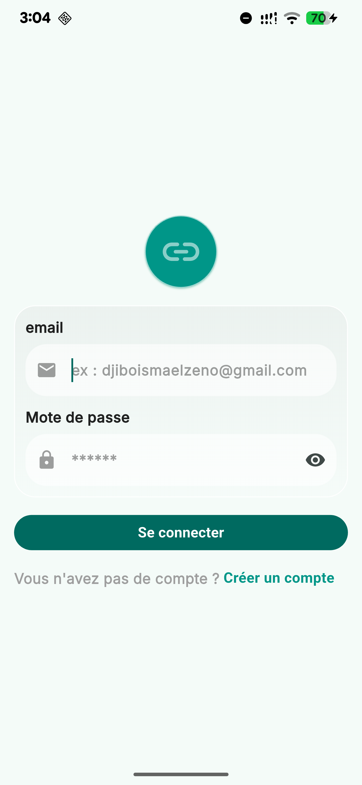 | 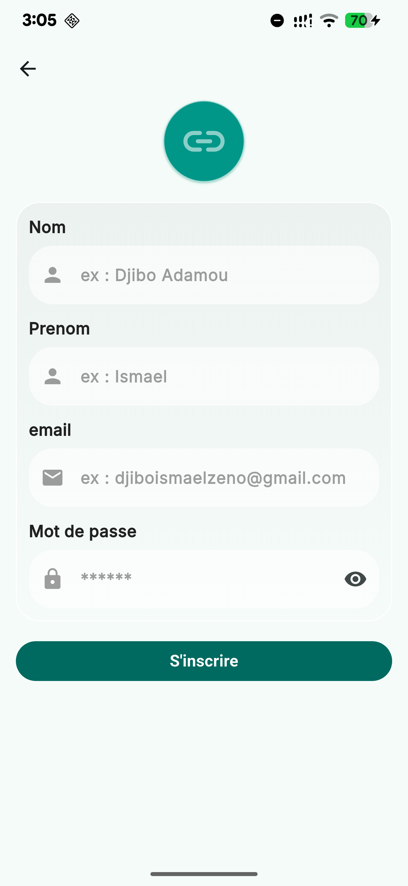 |  | 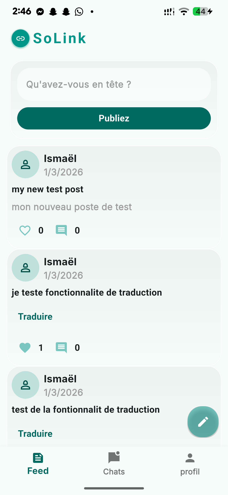 | 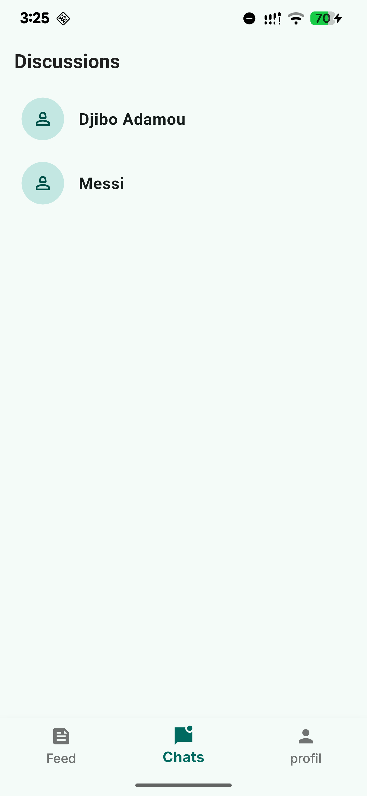 | 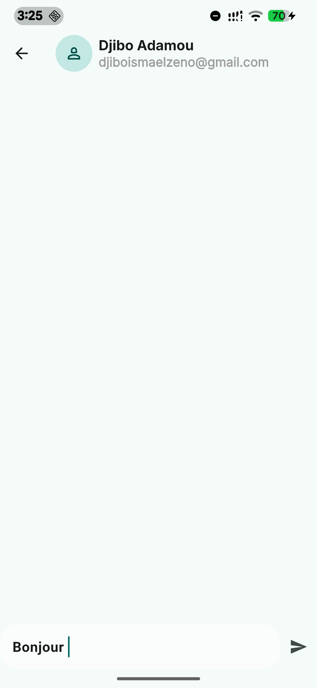 | 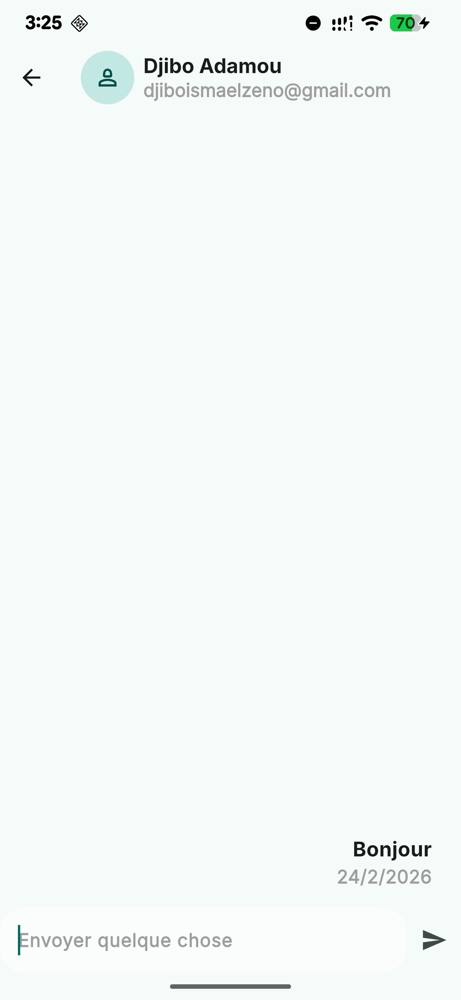 | 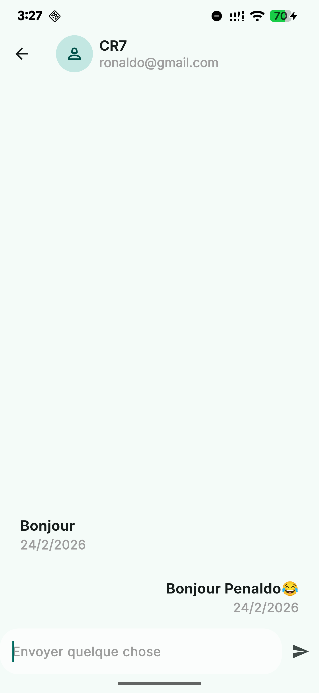 | 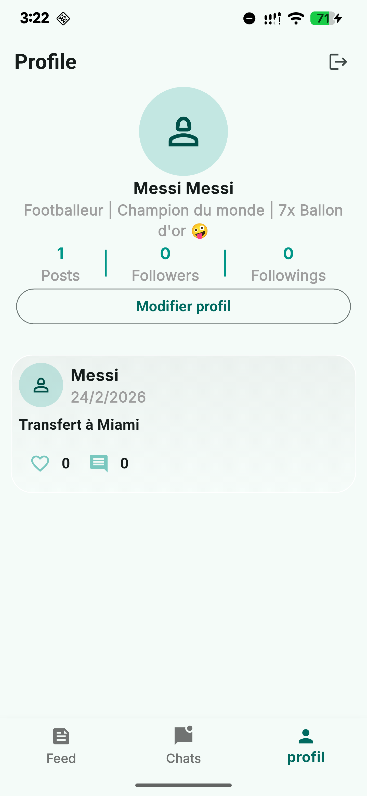 | 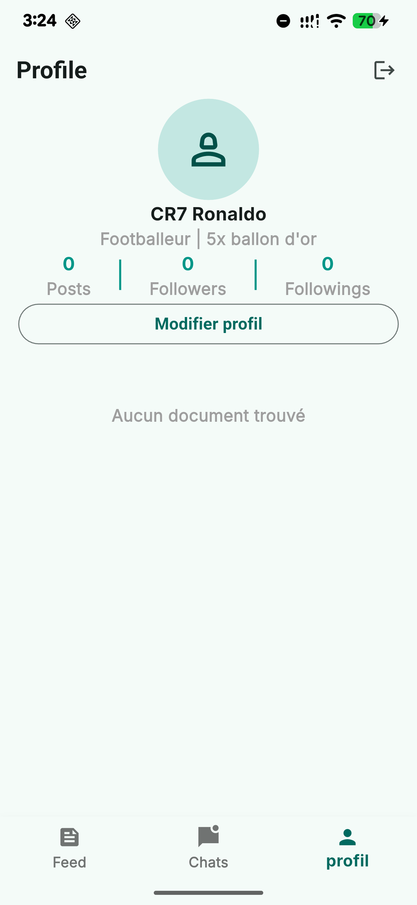 | 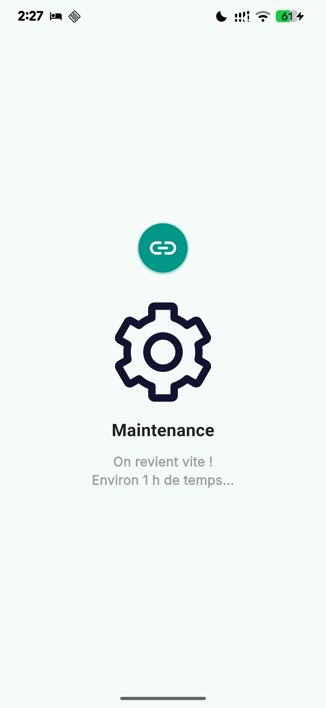 | 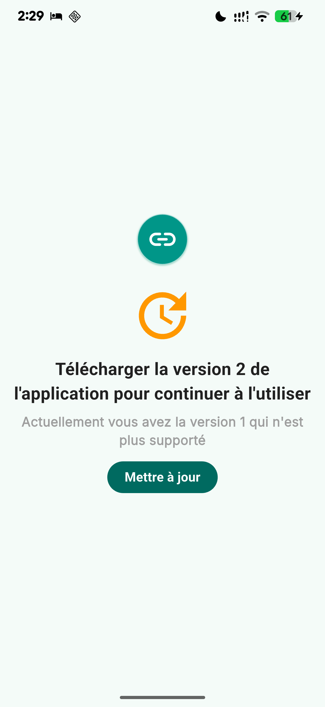